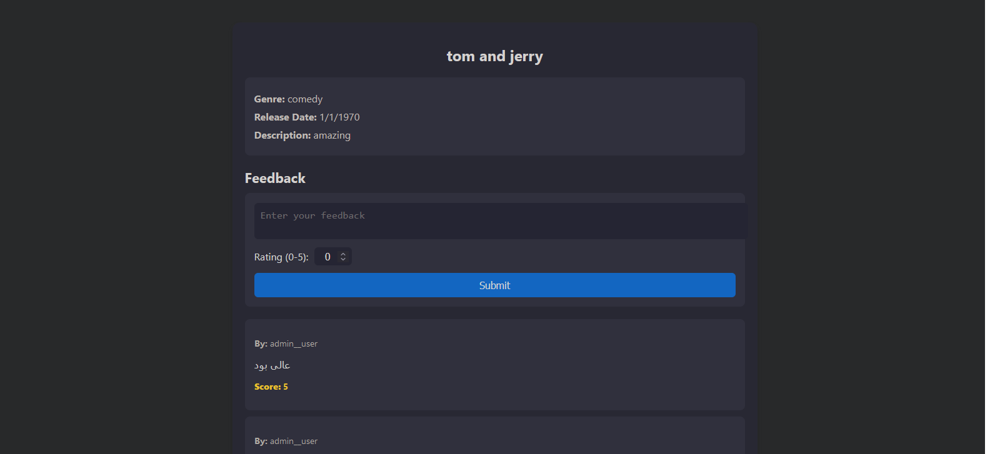
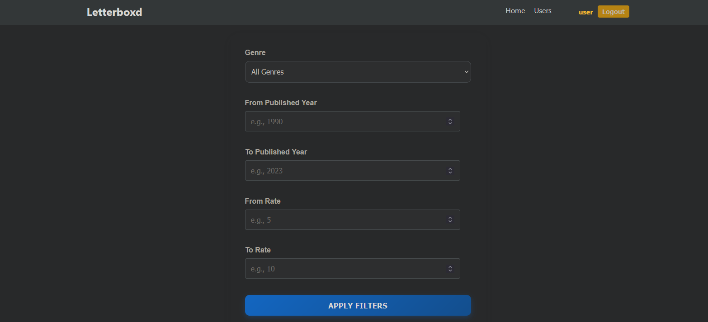
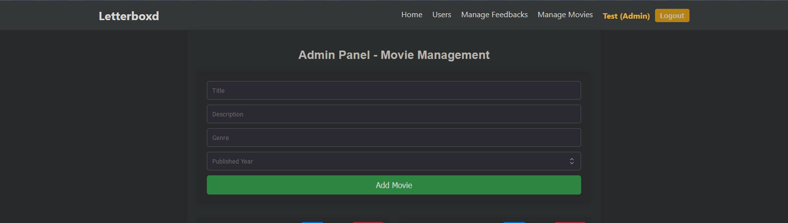
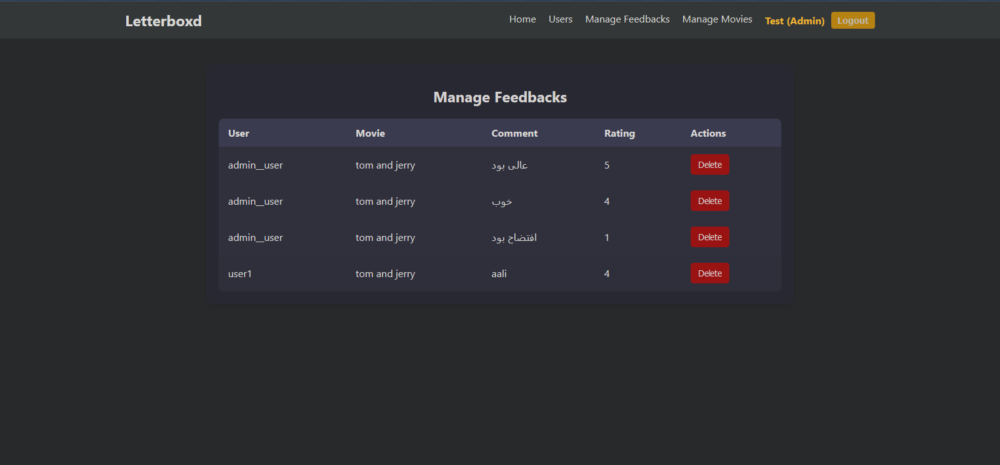
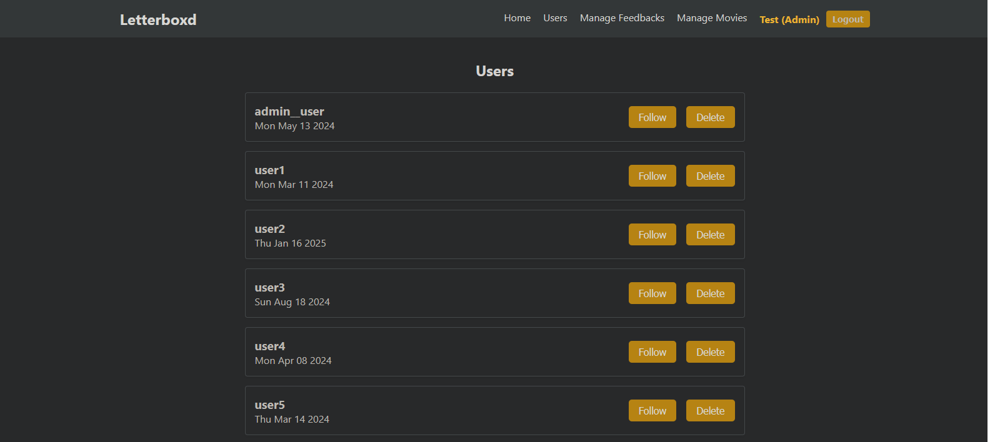

# Letterboxd Clone

A web application inspired by Letterboxd, built with React for the front-end and Express.js for the back-end.

## Table of Contents

-   [Features](#features)
-   [Getting Started](#getting-started)
    -   [Backend Setup](#backend-setup)
    -   [Frontend Setup](#frontend-setup)
-   [Contributing](#contributing)
-   [GitHub Repository](#github-repository)

## Features

This application offers a range of features similar to Letterboxd, including:

*   Movie Tracking: Keep track of movies you've watched.
*   Reviews and Ratings: Write reviews and rate movies.
*   Watchlists: Create lists of movies you want to see.
*   User Profiles: View your profile and the profiles of other users.
*   Filtering Functionality: Filter movies based on genres, years, and rate

Here's a quick look at some of the key features:

**Movie Reviews:**


*Users can add and view movie reviews.*

**Filtering:**


*Users can filter movies based on rate, year, and genre.*

**Manage movies:**


*Admins can add edit and remove movies.*

**Manage feedbacks:**


*Admins can add edit and remove feedbacks.*

**Manage users:**


*Admins can add edit and remove users.*

## Getting Started

Follow these instructions to get the application running on your local machine.

### Backend Setup (Express.js)

1.  **Clone the repository:**

    ```bash
    git clone https://github.com/Ashkan0026/Letterboxd.git
    cd Letterboxd
    cd server
    ```

2.  **Install dependencies:**

    ```bash
    npm install
    # or
    yarn install
    ```

3.  **Install better-sqlite3:**

    ```bash
    npm install better-sqlite3
    # or
    yarn add better-sqlite3
    ```

4.  **Run the backend server:**

    ```bash
    node main.js
    ```

    The backend server should now be running (likely on port 9090, but check your server logs for the exact address).

### Frontend Setup (React)

1.  **Navigate to the frontend directory:**

    ```bash
    cd ../letterboxd
    ```

2.  **Install dependencies:**

    ```bash
    npm install
    # or
    yarn install
    ```

3.  **Start the React development server:**

    ```bash
    npm start
    # or
    yarn start
    ```

    This will typically start the React application on `http://localhost:3000` (or similar). If prompted, allow access through your firewall.

## Contributing

Contributions are welcome! Feel free to submit pull requests with bug fixes, new features, or improvements to the documentation.


## GitHub Repository

[https://github.com/Ashkan0026/Letterboxd](https://github.com/Ashkan0026/Letterboxd)